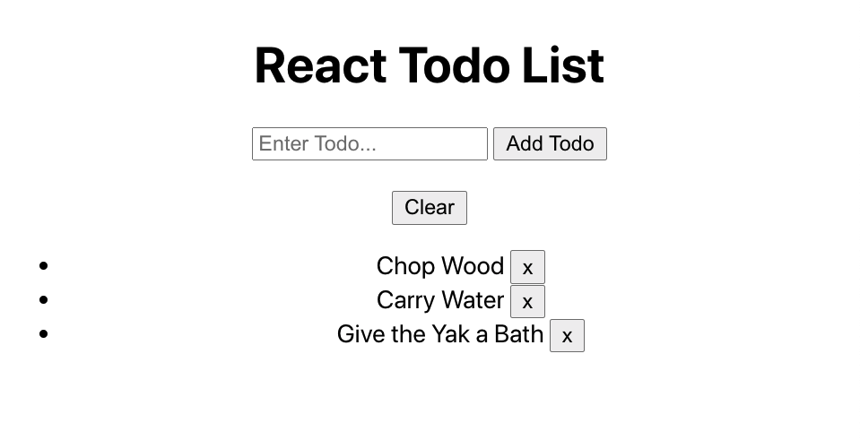
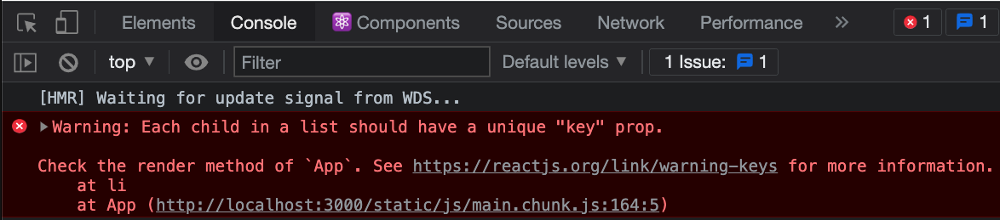

# React Todo

To further our journey into React state we will cross the age old rite of passage for every developer learning a new technology.

We will build a todo list.



We'll be able to...
- enter in a todo item
- see that item displayed

Bonus Features
- remove the item from the list
- and clear our list of todos

## Setup

Navigate to the proper directory where you keep your code activities and create a a new React App with

```bash
npx create-react-app react-todo
```

Once the React App has finished being created, navigate into the new `react-todo` folder that was created and start the app.

```bash
cd react-todo
npm start
```

We should see the boilerplate app displaying in the browser.

# Let's Code

Make your way into the App component in `/src/App.js` and remove all of the JSX except the wrapping div. We won't need that code where we're going...

In the wrapping div place an `<h1>` that says "React Todo".

We are also going to be adding state to this App component so we'll convert it to a class component.

```js
import React from 'react';
import './App.css';

class App extends React.Component {
  render() {
    return (
      <div className="App">
        <h1>React Todo</h1>
      </div>
    );
  }
}

export default App;
```

Points to Remember When Converting to a Class Component
- import the react library at the top of the file.
- Have your component extend `React.Component`.
- Give your component a `render()` method and have the render method return JSX.

## Add Some JSX

Under your `<h1>`, we'll add a form with a text input and a button.

```js
...
render() {
  return (
    <div className="App">
      <h1>React Todo</h1>
      
      <form>
        <input type="text" />

        <input type="submit" value="Add Todo" />
      </form>
    </div>
  );
}
...
```

---

## Store Input Value in State

When working with input fields in React, we'll want to store the input value in the component's state. This allows us to easily work with the input value when we need.

---

Add state your App component and within it add a property called `inputVal` set to an empty string.

```js
class App extends React.Component {
  state = {
    inputVal: ''
  }

  render() {
    return (
      <div className="App">
        <h1>React Todo</h1>
        
        <form>
          <input type="text" />

          <input type="submit" value="Add Todo" />
        </form>
      </div>
    );
  }
}
```

---

Now set the value of the text input to refer to `inputVal` in state. We'll see why in a moment.

```js
...
<form>
  <input type="text" value={this.state.inputVal} />

  <input type="submit" value="Add Todo" />
</form>
...
```

Try typing into your text input. You'll notice you are no longer able to! The input value is being pulled from `this.state.inputVal` which is set to an empty string.

What happens if we change the value in state from an empty string to some other string?

...

We see a change in our UI!

<br>

---

## Listen for an onChange Event

We want to listen for when a user tries typing into the input and then update the value stored in state.

Just as we can add an `onClick` event listener to an element, we'll add an `onChange` event listener to the input. 

```js
...
<form>
  <input 
    type="text" 
    value={this.state.inputVal} 
    onChange={this.handleInputChange}
  />

  <input type="submit" value="Add Todo" />
</form>
...
```

Into the `onChange` listener we can pass a function that we want to be called when a user types into the input. We'll pass `this.handleInputChange`. Our code will break because we haven't created this function yet.

<br>

---

## Create a Handler Function

Create a method called `handleInputChange` above your render that logs out a simple message.

```js
class App extends React.Component {
  state = {
    inputVal: 'hellooooooop'
  }

  handleInputChange = () => {
    console.log('A user typed!');
  }

  render() {
    return (
      <div className="App">
        <h1>React Todo</h1>
        
        <form>
          <input 
            type="text" 
            value={this.state.inputVal} 
            onChange={this.handleInputChange}
          />

          <input type="submit" value="Add Todo" />
        </form>
      </div>
    );
  }
}
```

In React, anytime a method is being triggered by a DOM event (click, hover, input change, etc...) we'll want to make sure the method is an arrow function. This will allow us to preserve the `this` property inside of the method and allow us to do things like `this.setState()`.

Test it out. When typing we should trigger the method and get our log message!

<br>

---

## Update State

We want `handleInputChange` to update our state, setting `inputVal` in state to the value currently being typed into the input.

Replace the console.log with this code.

```js
...
handleInputChange = (event) => {
  this.setState({ inputVal: event.target.value });
}
...
```

Let's break down what's going on here. The `event` parameter being passed in is a giant object containing a bunch of information about the "change event" that has taken place, including the value that was typed into the input. `event.target.value` stores this typed value.

We use `this.setState` to set `inputVal` to the typed value.

Try it out! You should see the input works as expected again.

--- 

### Why Do We Do This?

The input was working just fine when we first created it. Why go through all this trouble?

the kicker here is, we are storing the input's value in the component's state. This allows us to easily work with this input value later on when we click "Add Todo" and add a new todo.

<br>

---

## Store Todos in State

All fine and good. But we want to add a todo to a list and see that list showing up in the browser.

We'll store that list of todos in the component's state.

```js
...
  state = {
    inputVal: '',
    todoList: []
  }
...
```

<br>

---

## Add a Todo to State

When a user clicks "Add Todo" and submits the form, we want to add a todo into state.

Add an `onSubmit` event listener to the form and set it a method that will handle the submit event.

```js
...
<form onSubmit={this.handleAddTodo}>
  <input 
    type="text" 
    value={this.state.inputVal} 
    onChange={this.handleInputChange}
  />

  <input type="submit" value="Add Todo" />
</form>
...
```

Here we called the function `handleAddTodo` but you can call it anything. For example, you can also call it `handleSubmit`.

<br>

---

## Add a Handler

We don't have a method called `handleAddTodo` yet, so this code will break. Let's create one above the render method.

```js
...
handleInputChange = (event) => {
  this.setState({ inputVal: event.target.value });
}

handleAddTodo = () => {
  console.log('form submitted!');
}

render() {
...
```

Test it out! Open your dev console and try submitting the form. What do you see?

...

You might see somethiing flash quickly in your console and go away. What gives?

The browser's default behavior when submitting a form is to refresh the page. This isn't what we want.

In your `handleAddTodo` method pass the `event` object as a parameter and inside of the method call `event.preventDefault();`.

```js
...
handleAddTodo = (event) => {
  event.preventDefault();

  console.log('form submitted!');
}
...
```

Alright! We get our log message when we submit the form.

<br>

---

## Add a Todo in State

When submitting the form our goal is to update the `todoList` in state. How would we add a new todo into the `todoList` array? Could we use the `.push()` method? We'll explore another way and explain why we did it that way.

In `handleAddTodo` call `this.setState()` to update the `todosList` property. We'll set it to an array of our updated todos list. For now we'll set `updatedTodos` to an empty array.

```js
...
handleAddTodo = (event) => {
  event.preventDefault();

  const updatedTodos = [];
  
  this.setState({ todoList: updatedTodos });
}
...
```

## Spread Operator

`updatedTodos` should be an array of all of our existing todos with the brand new one tacked on as the last item in the array.

The [JavaScript spread operator](https://developer.mozilla.org/en-US/docs/Web/JavaScript/Reference/Operators/Spread_syntax) will make this very easy.

If you've never seen the spread operator, here is how it works.
<details>
  <summary></summary>

  Using the spread operator (`...`) we can take an existing array and "spread" its values out into a new array.

  Here we take two existing arrays and spread their items into a new array.
  ```js
  const fruits1 = ['apple', 'banana', 'pear'];
  const fruits2 = ['orange', 'watermelon'];

  const fruits3 = [
    ...fruits1,
    ...fruits2
  ];

  console.log(fruits3);
  // => ['apple', 'banana', 'pear', 'orange', 'watermelon'];
  ```

  We've combined two arrays into one.
</details>

Use the spread operator to set `updatedTodos` to the existing todos plus the brand new tacked on to the end.

```js
...
handleAddTodo = (event) => {
  event.preventDefault();

  const updatedTodos = [
    ...this.state.todoList,
    this.state.inputVal
  ];

  this.setState({ todoList: updatedTodos });
}
...
```

To test your handy work...
- log out `this.state.todoList` at the top of your component's `render` method.
- Try adding some todos!

```js
...
render() {
  console.log(this.state.todoList);

  return (
    <div className="App">
...
```

We should see that we are updating state when submitting the form!

<br>

---

## Handler for Rendering Todos

Now we're updating the `todoList` in state. Let's get that list of todos rendering on the page.

The goal is to loop through the `todoList` array and render an `<li>` for every item in the array.

We could do that looping direct in JSX of our `render` but better to keep our main render method clean of too much logic.

Create a method called `renderTodos` above your `render` method. This method will be in charge of looping and rendering todos. For now, have it return some dummy JSX.

```js
...
renderTodos() {
  return <li>All my todos</li>;
}

render() {
...
```

In the component's render method add an `<ul>` under the `<form>` tag and call `this.renderTodos()` inside of the `<ul>`.

```js
...
render() {
  return (
    <div className="App">
      <h1>React Todo</h1>
      
      <form onSubmit={this.handleAddTodo}>
        <input 
          type="text" 
          value={this.state.inputVal} 
          onChange={this.handleInputChange}
        />

        <input type="submit" value="Add Todo" />
      </form>

      <ul>
        {this.renderTodos()}
      </ul>
    </div>
  );
}
...
```

We should see our dummy content showing up on the page.

## Render Todos

We'll set up the `renderTodos` method to return the JSX for all the todos in `todoList` being stored in state.

In `renderTodos` declare a variable, `todosJSX` and set it to an empty array. We'll fill this array with one `<li>` for each todo on our list.

```js
...
renderTodos() {
  let todoJSX = [];

  return <li>All my todos</li>;
}
...
```

Use the `.forEach()` method to loop through each todo in our `todoList` array. For each todo in `todoList`, we'll push an `<li>` into the `todoJSX` array and fill it with that todo item.

```js
...
renderTodos() {
  let todoJSX = [];

  this.state.todoList.forEach((todo) => {
    todoJSX.push(<li>{todo}</li>);
  });

  return todoJSX;
}
...
```

Test it out in the browser. Start adding todos and watch them display on the screen right before your eyes!

---

Another way to do this using the JavaScript `.map()` method.
<details>
  <summary></summary>

  ```js
  renderTodos() {
    return this.state.todoList.map((todo) => {
      return <li>{todo}</li>;
    });
  }
  ```
</details>

<br>

---

## Adding a Key Prop

If you check the console, you might notice we have a nasty looking warning.



Whenever we create an array of JSX items, React will want us to give each item a unique "key" prop.

In `renderTodos` add the index as a parameter to the `.forEach()` method and pass it as a "key" prop to the `<li>`.

```js
...
renderTodos() {
  let todoJSX = [];

  this.state.todoList.forEach((todo, idx) => {
    todoJSX.push(<li key={idx}>{todo}</li>);
  });

  return todoJSX;
}
...
```

Providing this "key" prop allows React to render and re-render efficiently behind the scenes. Read more about it [here](https://reactjs.org/docs/lists-and-keys.html#keys)

<br>

---

## Clear the Input

One more touch up before we wrap up. When submitting the form and adding a new todo, we'll want to clear the input.

Update `handleAddTodo`, in the `this.setState()` call to set `inputVal` to an empty string.

```js
handleAddTodo = (event) => {
  event.preventDefault();

  const updatedTodos = [
    ...this.state.todoList,
    this.state.inputVal
  ];

  this.setState({ todoList: updatedTodos, inputVal: '' });
}
```

<br>

---

## Hungry For More?

- Make a `TodoItem` component and render a list of them for your todo list.
- Add a button to clear all todos.
- Give each todo item a delete button that will delete the todo when clicked.
